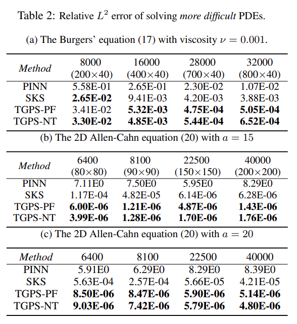
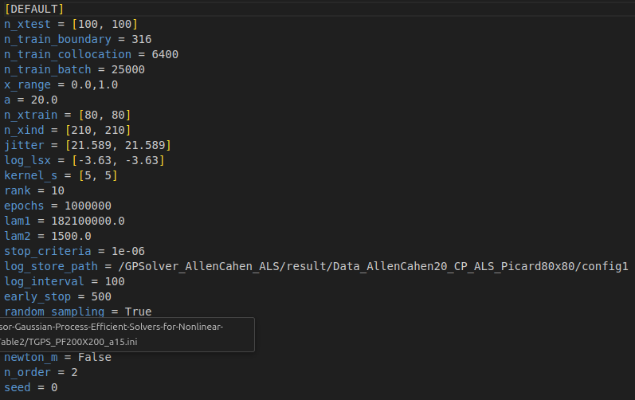
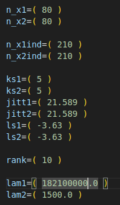
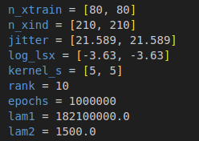

# [Tensor Gaussian Process: Efficient Solvers for Nonlinear PDEs] (AISTATS 2026)

This repository contains the official implementation of the paper "[Tensor Gaussian Process: Efficient Solvers for Nonlinear PDEs]" accepted at AISTATS 2026.

Python libraries needed for running codes can be checked in the requirements.txt.

Each folder consists of the implementation to one Partial Differential Equation problem specified by the folder name. 

Each folder contains all necessary scripts for running. You can just download one folder and run the experiments.

## How to reproduce the results in the paper?

We provide the training records containing all key parameters to reproduce the results published in the paper.

For example, if we want to reproduce Allen Cahen a=20 with number of collocation points equal 6400 in Table 2(c)

<p align="center">
  
</p>

The records are in "./Allen_Cahn2D/result_paper/Table2/"; 

"TGPS_PF80x80_a20.ini" represents the Allen_Cahn Problem with "a=20", using Partial Freezing Method under 6400(80x80) collocation points;

"TGPS_NT80x80_a20.ini" share same information except using Newton's Method.

Inside record, there exist 2 parts: The front one showing the specific papameters while the below training and testing result based on those parameters.

Here is the front part:
<p align="center">
  
</p>

Inside each folder(like "Allen_Cahn2D" here), there exist multiple bash run scripts which can be executed directly.

The name of bash script reflects the problem type and specific method in usage. For example, "run_Allen_Cahn2D_CP_ALS_PF_a20.sh" means the script is related to Allen Cahn 2D with a=20, the method is CP combined with Partial Freezing, corresponding to the records "TGPS_PF*_a20.ini".

But to reproduce the result in one specific record, saying "TGPS_PF80x80_a20.ini", you need to input the parameters shown above to the bash script accordingly. 

In each bash script, we put the key parameters to be modified for reproduction in variable settings:
<p align="center">
  
</p>

Which corresponds to the record's part:
<p align="center">
  
</p>

You can also check the parse section in the running code, saying "SolveAllenCahen.py" here, for more details.

## ADAM Method

There exist 4 folders: "GPSolver_Allen_Cahn2D_ADAM", "GPSolver_Allen_Cahn6D_ADAM", "GPSolver_Burgers_ADAM" and "GPSolver_Nonlinear_Elliptic_ADAM". These correspond to the baselines showing in the plot of Figure 2 in the paper.

## Citation

If you find this work useful, please cite our paper:

```bibtex
@inproceedings{yuantensor,
  title={Tensor Gaussian Processes: Efficient Solvers for Nonlinear PDEs},
  author={Yuan, Qiwei and Xu, Zhitong and Chen, Yinghao and Xu, Yiming and Owhadi, Houman and Zhe, Shandian},
  booktitle={The 29th International Conference on Artificial Intelligence and Statistics}
}


